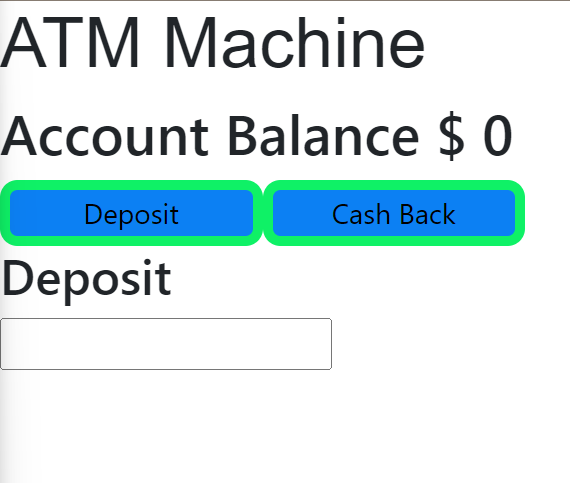

# ATMInReact
using react, create an ATM that can keep track of an account balance. It should also be able to deny a withdrawl if the account funds are insufficient. Using useState for the deposit it made it possible to remove the submit button. Now you can enter the amount and just click on the action you want. I also added an alrt window pop up if funds are insufficient.

Run: copy index.html, mapanimation.js and styles.css into the same folder. Either drag index.html into the browser or right click and select open with using your preferred browser.

Roadmap of future improvements: planning to add better colors to make it look better.

